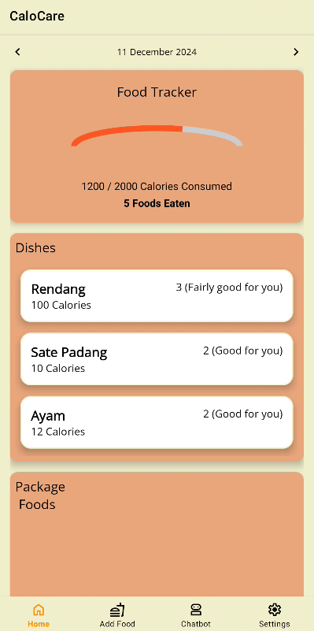
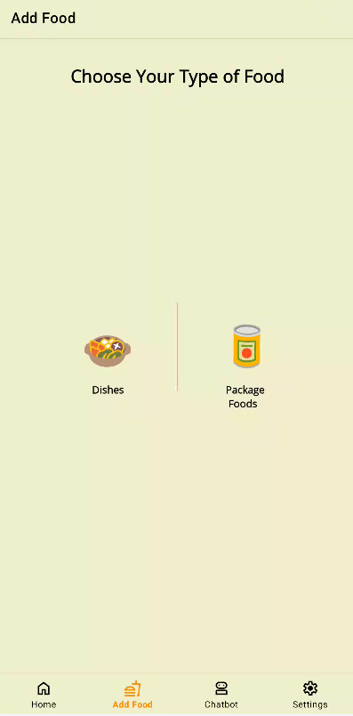
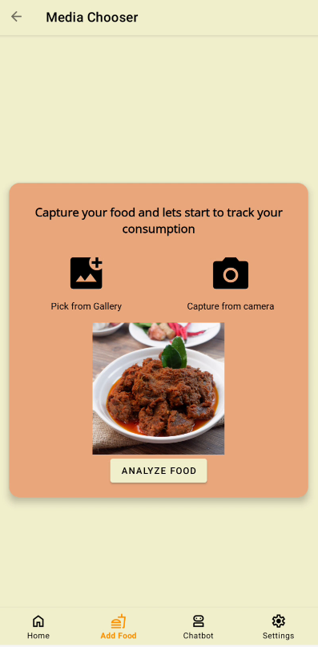
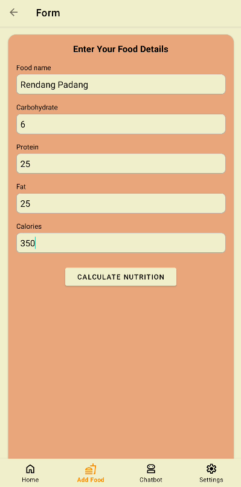
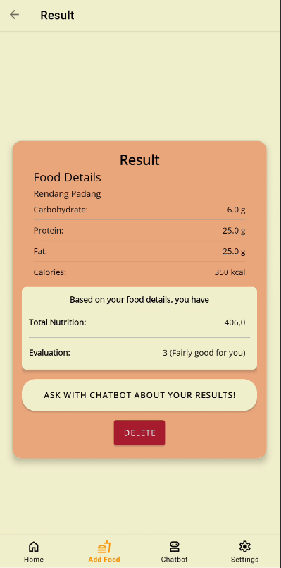
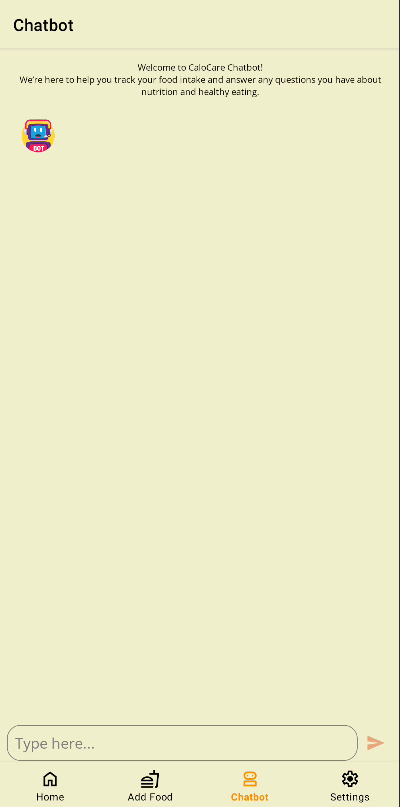
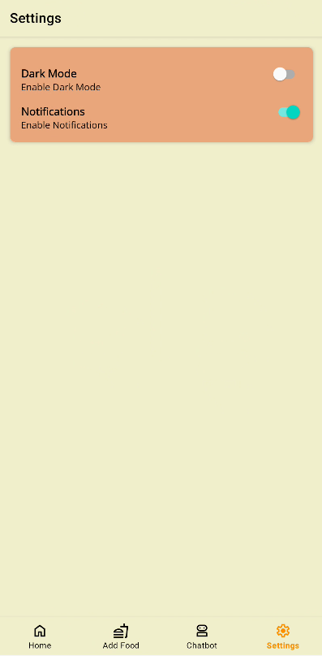

# CaloCare - Mobile Development

CaloCare is a comprehensive mobile application designed to help users manage their daily calorie intake and maintain a healthy lifestyle. This repository contains the Mobile Development part of the project.

## Features
- **Food Tracking**: Add and track dishes or packaged foods.
- **Nutrition Analysis**: Evaluate the nutritional value of food items.
- **Home Dashboard**: View added foods and their nutritional details.
- **Chatbot**: Interact with a chatbot for health-related queries.
- **Customizable Settings**: Modify app settings as per your preferences.

## Application Flow

Below is the application flow:









### Detailed Flow
1. **Add Food**:
   - User selects the type of food (dishes or packaged foods).
   - User inputs food details such as name, calories, protein, fat, and carbohydrates.
   - Food details are analyzed and stored.
   - The result is displayed to the user in the result screen.

2. **Home Screen**:
   - Displays a list of added foods with their nutritional details.
   - Allows navigation to other sections of the app.

3. **Chatbot**:
   - Provides an interactive interface for health-related queries.

4. **Settings**:
   - Enables users to configure preferences and notification.

## Tech Stack
- **Programming Language**: Kotlin
- **IDE**: Android Studio
- **Design**: Figma
- **API Testing**: Postman

## Installation
To install and run the project on your local machine:

1. Clone the repository:
   ```bash
   git clone https://github.com/SherrifRaynor/CaloCare-Bangkit2024.git
   ```

2. Navigate to the Mobile Development directory:
   ```bash
   cd CaloCare-Bangkit2024/app
   ```

3. Open the project in Android Studio.
4. Build and run the application on an Android device or emulator.

---

Thank you for using CaloCare! Let's make healthy living easier together.
